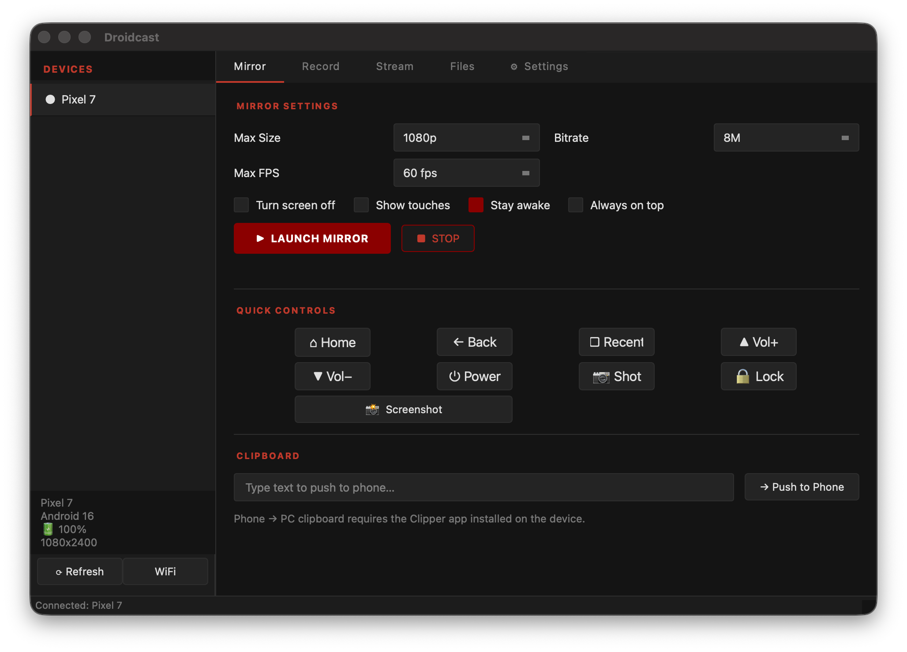

<div align="center">

# Droidcast

**Mirror · Control · Record · Stream**

A lightweight desktop app to mirror your Android device over USB (or WiFi), control it with your mouse and keyboard, record the screen, and stream it live to anyone on your network.

[](https://python.org)
[](https://pypi.org/project/PyQt6)
[](#installation)
[](LICENSE)



</div>

---

## Features

- **Mirror** — Full-resolution, low-latency screen mirroring powered by [scrcpy](https://github.com/Genymobile/scrcpy)
- **Control** — Use your mouse and keyboard to interact with the phone directly from your desktop
- **Quick Controls** — One-click Home, Back, Recents, Volume, Power, Screenshot, and Lock buttons
- **Record** — Capture the screen to an MP4 file with configurable quality and bitrate
- **Stream** — Share a live HLS stream over your local network — viewers open a URL in any browser or VLC
- **File Transfer** — Browse the device filesystem, push files from your computer, pull files to your computer
- **Clipboard Push** — Type on your laptop and instantly push text to the phone's clipboard
- **WiFi Mode** — Connect over USB once, then go fully wireless
- **System Tray** — Minimize to tray, keep running in the background
- **Dark Theme** — Clean dark UI that doesn't hurt your eyes at 2am

---

## Requirements

| Tool | Purpose | Install |
|------|---------|---------|
| [Python 3.10+](https://python.org) | Runs the app | See below |
| [scrcpy](https://github.com/Genymobile/scrcpy) | Screen mirroring & control | See below |
| [ADB](https://developer.android.com/tools/adb) | Device communication | Bundled with scrcpy or platform-tools |
| [FFmpeg](https://ffmpeg.org) | Live streaming (Stream tab only) | See below |

> **FFmpeg is only needed if you use the Stream tab.** Mirror, Record, and Files work without it.

---

## Installation

### macOS

```bash
# 1. Install Homebrew if you don't have it
/bin/bash -c "$(curl -fsSL https://raw.githubusercontent.com/Homebrew/install/HEAD/install.sh)"

# 2. Install dependencies
brew install scrcpy ffmpeg

# 3. Clone the repo
git clone https://github.com/YOUR_USERNAME/droidcast.git
cd droidcast

# 4. Install Python dependencies
pip3 install -r requirements.txt

# 5. Run
python3 main.py
```

---

### Windows

**1. Install scrcpy**

Download the latest release from [github.com/Genymobile/scrcpy/releases](https://github.com/Genymobile/scrcpy/releases) and extract it somewhere (e.g. `C:\scrcpy`). Add that folder to your `PATH`:

> Start → search "Environment Variables" → Edit the system environment variables → Environment Variables → Path → New → `C:\scrcpy`

**2. Install FFmpeg** *(for streaming only)*

Download from [ffmpeg.org/download.html](https://ffmpeg.org/download.html) (get a Windows build), extract, and add `bin\` to your `PATH` the same way.

**3. Install Python 3.10+**

Download from [python.org/downloads](https://python.org/downloads). Make sure to check **"Add Python to PATH"** during install.

**4. Clone and run**

```powershell
git clone https://github.com/YOUR_USERNAME/droidcast.git
cd droidcast
pip install -r requirements.txt
python main.py
```

---

### Linux (Debian / Ubuntu)

```bash
# 1. Install dependencies
sudo apt update
sudo apt install -y scrcpy ffmpeg python3 python3-pip

# 2. Clone the repo
git clone https://github.com/YOUR_USERNAME/droidcast.git
cd droidcast

# 3. Install Python dependencies
pip3 install -r requirements.txt

# 4. Run
python3 main.py
```

**Arch Linux:**
```bash
sudo pacman -S scrcpy ffmpeg python python-pip
```

**Fedora:**
```bash
sudo dnf install scrcpy ffmpeg python3 python3-pip
```

---

## Phone Setup

1. On your Android device, go to **Settings → About Phone** and tap **Build Number** 7 times to enable Developer Options
2. Go to **Settings → Developer Options** and enable **USB Debugging**
3. Connect your phone to your computer with a USB cable
4. Accept the **"Allow USB debugging?"** prompt on your phone
5. Launch Droidcast — your device will appear in the sidebar automatically

---

## Usage

### Mirror Tab

| Setting | Description |
|---------|-------------|
| Max Size | Limits the resolution sent over USB (lower = faster, less CPU) |
| Bitrate | Video quality. 8M is a good default |
| Max FPS | Cap the framerate. 60fps is smooth, 30fps saves resources |
| Turn screen off | Keeps your phone screen off while mirroring (saves battery) |
| Show touches | Shows touch indicators on screen |
| Stay awake | Prevents phone from sleeping while connected |
| Always on top | Keeps the mirror window above other windows |

Click **LAUNCH MIRROR** to open the scrcpy window. Your phone screen appears and you can interact with it using your mouse and keyboard.

**Quick Controls** — buttons for Home, Back, Recents, Volume Up/Down, Power, Screenshot, and Lock. These work even without the mirror window open.

**Clipboard** — type any text and click **Push to Phone** to paste it into the phone's clipboard instantly.

### Record Tab

Choose an output folder, set quality, and click **START RECORDING**. The timer counts up while recording. Click **STOP** to finish — the file appears in the Recent Recordings list. Double-click or use **Open** to play it.

### Stream Tab

Click **START STREAM** and share the URL shown (e.g. `http://192.168.1.10:8888`) with anyone on your local network.

**Viewers can open it in:**
- Any modern web browser (Chrome, Firefox, Safari)
- VLC: **Media → Open Network Stream** → paste the URL

> **Note:** Android's `screenrecord` API has a ~3 minute limit per session. The stream restarts automatically — viewers may see a 1-2 second gap every 3 minutes.

### Files Tab

Browse your phone's filesystem starting at `/sdcard`. Double-click folders to navigate into them. Use **← Back** to go up.

- **Push** — select a file from your computer to copy onto the phone at the current path
- **Pull** — select a file on the phone and save it to your computer
- **Delete** — delete a file or folder from the phone (with confirmation)

### WiFi Mode

1. Plug in your phone via USB
2. Select it in the sidebar → click **WiFi**
3. Click **Enable WiFi ADB** — it shows your phone's IP
4. Click **Connect**
5. Unplug the USB cable — the device stays connected wirelessly

---

## Settings

| Setting | Description |
|---------|-------------|
| adb path | Path to the `adb` binary. Leave blank to auto-detect |
| scrcpy path | Path to `scrcpy`. Leave blank to auto-detect |
| ffmpeg path | Path to `ffmpeg`. Leave blank to auto-detect |
| Record folder | Default save location for recordings |
| Stream port | HTTP port for the live stream server (default: 8888) |
| Minimize to tray | Close button hides to system tray instead of quitting |

Click **Test All Tools** to verify that adb, scrcpy, and ffmpeg are all found correctly.

---

## Troubleshooting

**Device not showing up**
- Make sure USB Debugging is enabled on the phone
- Try a different USB cable (data cable, not charge-only)
- Run `adb devices` in a terminal to check if ADB can see the phone
- Accept the USB debugging prompt on the phone if it appears
- On Linux: run `sudo adb kill-server && sudo adb start-server`

**"scrcpy not found"**
- Make sure scrcpy is installed and on your `PATH`
- Open Settings tab → set the scrcpy path manually → Test All Tools

**Stream not working**
- Make sure ffmpeg is installed: run `ffmpeg -version` in a terminal
- Some Android devices don't support `screenrecord --output-format=h264` — this is a device limitation
- Try lowering the resolution in Stream settings

**Low FPS / laggy mirror**
- Lower Max Size to 720p
- Lower Bitrate to 4M
- Enable "Turn screen off" to reduce phone GPU load
- Use a USB 3.0 port or cable

**WiFi connection drops**
- Make sure your phone and computer are on the same WiFi network
- Disable firewall rules blocking port 5555 temporarily

---

## Platform Notes

| Feature | macOS | Windows | Linux |
|---------|-------|---------|-------|
| Mirror & Control | ✅ | ✅ | ✅ |
| Record | ✅ | ✅ | ✅ |
| Stream | ✅ | ✅ | ✅ |
| File Transfer | ✅ | ✅ | ✅ |
| WiFi Mode | ✅ | ✅ | ✅ |
| System Tray | ✅ | ✅ | ✅ (needs libappindicator) |

---

## License

MIT © [@glaive](https://github.com/PolarBearStan009)

Built on top of [scrcpy](https://github.com/Genymobile/scrcpy) by Genymobile — the real MVP.
